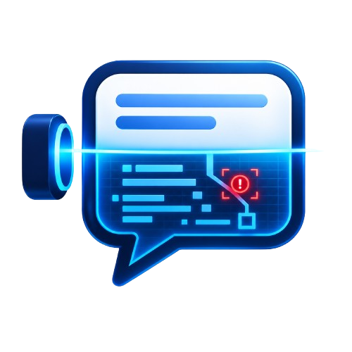

<p align="center">
  
</p>

<h1 align="center">X-Ray</h1>
<p align="center"><strong>Finding the Hidden Failures in AI-Agent Conversations</strong></p>

<p align="center">
  
  
  
  
  
</p>

<p align="center">
  Built for SupplyzPro's <em>Smart Operations Award</em> — "Come Build with AI" hackathon challenge
</p>

<p align="center">
  <a href="#architecture">Architecture</a> ·
  <a href="#setup">Setup</a> ·
  <a href="#running-the-full-stack">Run it</a> ·
  <a href="#testing">Tests</a> ·
  <a href="#evaluation">Evaluation</a> ·
  <a href="docs/backend-contract.md">API docs</a>
</p>

---

> We don't just find bugs in AI-agent conversations — we group them by root cause, rank them by real impact, and prove a fix works.

## The problem

Most agent failures never throw an error. A tool call "succeeds" with an empty or wrong result, the agent smooths it over with a confident sentence, and the only trace is a customer getting the wrong answer. X-Ray finds that gap between what a tool returned and what the agent claimed — not just counts of exceptions. It doesn't stop at "here's what went wrong": for every cluster it also explains *why* (a causal chain, not a guess), what it costs operationally, and what engineering fix would actually address it — see `ai/root_cause.py`, `ai/impact.py`, `ai/remediation.py`, assembled by `ai/executive_report.py` into `results/executive_report.md`.

## Architecture

```
ai/          The AI system: trace_investigator (normalize) -> failure_detective
             (detect, evidence-validated) -> pattern_hunter (cluster) ->
             prioritize -> root_cause / impact / remediation -> executive_report
             -> regression_probes (fix verification)
data/        Synthetic conversation generator (feeds the AI system)
results/     ai/ layer's JSON output, consumed by database/seed_db.py
evaluation/  Computes the required metrics against ground truth -> evaluation/results/
database/    SQLite — conversations, tool calls, detected failures, clusters,
             priority scores, root causes, regression probes
backend/     FastAPI — REST API in front of the database
frontend/    React (Vite) — the dashboard
tests/       unittest suite covering ai/ and backend/ (28 tests, all offline/deterministic)
docs/        backend-contract.md documents every endpoint's shape
app.py       Streamlit dashboard (kept as a zero-setup fallback demo)
```

`ai/trace_investigator.py`, `ai/failure_detective.py`, and `ai/pattern_hunter.py` are thin, tested wrappers: they don't reimplement detection or clustering, they validate it (every finding's evidence must reference a real turn) and generalize ingestion (accepts our canonical `turns` format, raw OpenAI-style `messages`, or tau-bench's `traj` — the same three shapes `data/fetch_real_world_sample.py` already had to handle by hand).

**Why root cause/impact/remediation are deterministic, not LLM-generated:** we constructed the failure taxonomy ourselves, so the causal chain, operational risk, and standard fix for each of the 7 failure types are known facts (`ai/root_cause.py`'s `CAUSAL_CHAINS`, `ai/impact.py`'s `POTENTIAL_IMPACT`, `ai/remediation.py`'s `REMEDIATIONS`), not something requiring inference. This keeps them fast, testable, and honest about confidence (`observed` / `strongly_supported` / `likely` / `possible`, never overclaiming) — an LLM call would add latency and hallucination risk for zero benefit here. The LLM is reserved for `ai/llm_judge.py`, where semantic comparison genuinely can't be done with a lookup table.

Data flow: `data/` generates conversations → `ai/` detects/clusters/prioritizes them into `results/*.json` → `database/seed_db.py` loads that into SQLite → `backend/` serves it over REST → `frontend/` renders it. `evaluation/` runs the same AI layer against ground truth separately, to score it rather than just run it.

## Team task split (5 people, work in parallel)

Everyone can start immediately — the layers are already wired together end to end with synthetic data, so no one is blocked waiting on anyone else. Pull latest, then work in your own folder.

**1. AI/Detection** — `ai/`
- `rules.py` (error codes, timeouts, retry-loop duplicate calls), `llm_judge.py` (hallucination + wrong-target detection), `behavioral.py` (context collapse, user frustration), `cluster.py` (TF-IDF/KMeans root-cause grouping), `prioritize.py` (the scoring formula), `root_cause.py` / `impact.py` / `remediation.py` (why it happens, what it costs, how to fix it), `executive_report.py` (assembles all of it), `regression_probes.py` (fix verification).
- Today: set `NVIDIA_API_KEY` in `.env` (see `.env.example`) so `llm_judge.py` calls a real NVIDIA NIM model instead of the offline fallback heuristic. Sanity-check detection quality; tune clustering if categories look muddy. Re-run with `python -m ai.run_pipeline`.

**2. Data** — `data/`
- `generate_conversations.py` — the synthetic conversation generator (60 "before" / 60 "after" conversations, 6 seeded failure types, plus legitimate-retry and self-correction-recovery cases that should *not* be flagged).
- Today: add more variety (more SKUs/suppliers/phrasing) so the demo doesn't look templated. Regenerate with `python data/generate_conversations.py`.

**3. Database** — `database/`
- `schema.sql` (conversations, turns, tool_calls, clusters, failure_instances, priority_scores, root_causes, regression_probes tables), `seed_db.py` (loads `results/*.json` into `xray.db`).
- Today: own the schema — extend it if the AI or backend teams need new fields. Re-seed with `python -m database.seed_db` any time `results/` changes.

**4. Backend** — `backend/`
- `main.py` — FastAPI app, 12 endpoints: summary, clusters, priority, evidence, analysis (root cause/impact/remediation), root-cause, fix-comparison (legacy + cluster-scoped), conversations, failures, evaluation. Full shapes documented in `docs/backend-contract.md`.
- Run with `uvicorn backend.main:app --reload --port 8000`; interactive docs at `/docs`.

**5. Frontend** — `frontend/`
- React + Vite dashboard in `frontend/src/`: `Layout`/`Header`/`Tabs`/`SkeletonLoader` for the shell, `StatsCards`/`FailureFamiliesChart`/`FailureTrendChart` for the overview, `ClusterTable`/`EvidencePanel`/`Transcript`/`ClusterAnalysis`/`FixComparison` for the analysis views, all fetched through shared hooks in `src/hooks/useXrayData.js` and `src/api.js`.
- Five pages: Dashboard, Failure Clusters, Trace Explorer, Replay Lab, Evaluation.
- Run with `npm run dev` inside `frontend/` (copy `.env.example` to `.env` first).

## Setup

```bash
# Python side (ai, database, backend)
pip install -r requirements.txt
cp .env.example .env   # optional: add NVIDIA_API_KEY for a live NIM judge

# Frontend
cd frontend && npm install && cp .env.example .env
```

## Running the full stack

```bash
# 1. (re)generate synthetic data, if you changed the generator
python data/generate_conversations.py

# 2. detect -> cluster -> prioritize -> regression probes
python -m ai.run_pipeline

# 3. load results into the database
python -m database.seed_db

# 4. start the API
uvicorn backend.main:app --reload --port 8000

# 5. start the frontend (separate terminal)
cd frontend && npm run dev
```

`data/*.json`, `results/*.json`, and `database/xray.db` are all committed, so steps 4-5 work immediately without re-running 1-3 — only re-run them if you change the generator or detection logic.

**Fallback demo path**: `streamlit run app.py` reads `results/*.json` directly and needs nothing else running — useful if the full stack isn't up yet during the demo.

## Deployment

Two paths, pick based on how much time you have:

- **Zero-setup (Streamlit)** — deploy `app.py` to [Streamlit Community Cloud](https://share.streamlit.io): point it at this repo, `main` branch, `app.py` as the entry file. Reads the committed `results/*.json` directly, no backend or database to stand up. **Set sharing to "This app is public"** in the app's Settings → Sharing — it's private by default, which blocks anyone without your Streamlit account from opening the link.
- **Full stack (React dashboard)** — backend on [Render](https://render.com) (build: `pip install -r requirements.txt`, start: `uvicorn backend.main:app --host 0.0.0.0 --port $PORT`), frontend on [Vercel](https://vercel.com) with Root Directory set to `frontend` and `VITE_API_BASE_URL` pointed at the Render URL. `.vercelignore` and `frontend/vercel.json` are already committed so Vercel treats this as a plain static Vite build and doesn't try to auto-detect the Python files elsewhere in the repo as serverless functions.

## Testing

```bash
python -m unittest discover -s tests
```

28 tests, all offline and deterministic (a live `NVIDIA_API_KEY` in `.env` doesn't change the outcome — the one test whose finding count depends on which judge backend is active asserts the guaranteed finding rather than an exact count). Covers `ai/trace_investigator.py` (canonical + raw chat-message + tau-bench formats, malformed-input rejection), `ai/failure_detective.py` (evidence validation), `ai/pattern_hunter.py` (batch-scoped cluster identity), end-to-end trace scenarios against fixtures in `tests/fixtures/`, the versioned pipeline artifact, and every backend route against a temporary seeded database. Full endpoint documentation, including why root-cause/priority data is only seeded for the `before` batch, is in `docs/backend-contract.md`.

## NVIDIA integration

The LLM-as-judge layer (`ai/llm_judge.py`) calls NVIDIA's hosted NIM chat-completions API when `NVIDIA_API_KEY` is set (get one at [build.nvidia.com](https://build.nvidia.com)). Without a key, it falls back to a deterministic offline heuristic that checks the same two things (claimed numbers match the tool's response, claimed entity matches the one requested) — so the pipeline is reproducible without any external dependency, and swapping in a live model is a one-line env var change.

## Evaluation

```bash
python -m evaluation.run_evaluation
```

Computes the six required metrics against the synthetic ground truth in `data/conversations_before.json` and writes `evaluation/results/metrics.json` / `metrics.md`:

| Metric | Result (local-only run) |
|---|---|
| Failure detection precision / recall | 1.00 / 1.00 (28 true positives, 0 false positives, 0 false negatives) |
| Cluster precision / recall (pairwise) | 1.00 / 1.00 |
| Root-cause accuracy | 1.00 |
| Silent-failure recall | 1.00 |
| Analysis latency | detection ~0.002s, clustering ~1.7s, prioritization ~0s for 60 conversations |
| Cost per analysis | $0 (offline heuristic judge); with `NVIDIA_API_KEY` set, ~1 LLM call per tool call, free tier during the hackathon |

These numbers are close to 1.0 because the dataset is synthetic and deliberately clean-labeled — they demonstrate the pipeline is internally consistent (it doesn't cry wolf on the legitimate-retry/self-correction-recovery cases mixed into the same batch), not that it would score this well on messy real-world logs. See below for that check.

### Real-world validation set

To test on data we didn't design ourselves: `data/fetch_real_world_sample.py` pulls 78 real GPT-4o agent transcripts across **two domains** — retail customer service and airline booking/support — from [tau-bench](https://github.com/sierra-research/tau-bench) (Sierra Research, MIT license), a public benchmark with real tool calls and its own task-completion grader (`reward`), neither of which we designed.

```bash
python data/fetch_real_world_sample.py       # downloads and converts the sample (both domains)
python -m evaluation.run_real_world_evaluation
```

Result, against tau-bench's `reward` signal: **32% recall / 33% false-positive rate overall** (retail: 17%/20%, airline: 45%/45%) — much lower than the synthetic 1.00/1.00, and it should be: `reward` is a blunt proxy for what we actually target. Full breakdown in `evaluation/results/real_world_metrics.json`, but the honest summary is three-way, not one-way:

1. **Domain mismatch** — the LLM-judge's domain-specific hallucination heuristic (tuned for our supply-chain schema) doesn't engage with retail/airline's different tool and response shapes; only the domain-agnostic rule-based and behavioral layers meaningfully transfer.
2. **Some "failures" aren't hidden failures** — several reward=0 conversations are the agent honestly telling the user it's stuck (never got an order ID, so it says so) — a genuinely incomplete task, not a hidden one, and the detector is right to stay quiet.
3. **Some "successes" still have real friction** — several reward=1 conversations involve the user pushing back 2-3 times on the same unmet request before the agent relents. The task completes correctly, but the interaction wasn't smooth — arguably worth surfacing to an ops team regardless of the final outcome. This shows up more on airline (more negotiation-heavy dialogue: compensation, refund exceptions) than retail.

Investigating the false positives along the way also caught and fixed two real detector bugs, both with zero regression on the synthetic set (still 1.00/1.00 everywhere): `ai/rules.py`'s silent-failure check wasn't looking past same-turn text (missed cases where the narration is a separate later turn), and `ai/behavioral.py`'s frustration check was counting shared stopwords as repetition. A third bug (`ai/rules.py` crashing on a non-dict tool response, which airline's data has and retail's didn't) was also fixed.

## Disclosure

Most conversation data is **synthetic**, generated by `data/generate_conversations.py` to represent plausible SupplyzPro workflows with deliberately seeded failure patterns. A 78-conversation **real-world validation set** (`data/conversations_real_world.json`, retail + airline domains) comes from [tau-bench](https://github.com/sierra-research/tau-bench) (Sierra Research, MIT license), a public benchmark of real GPT-4o agent transcripts — used only to sanity-check the detector against data we didn't design, not fed into the main dashboard. AI tools used: an LLM-as-judge (NVIDIA NIM-hosted model, or an offline heuristic fallback) for hallucination/wrong-target detection, and TF-IDF/KMeans for unsupervised root-cause clustering. **NVIDIA Brev: not used** — no GPU compute was required for this project; the LLM-as-judge calls hosted inference (NIM) rather than running a model locally.

## Next steps

- Validate the LLM-judge rubric against a hand-labeled sample of real conversation/tool-call logs before trusting it at scale.
- Tune severity and blast-radius weights with input from the team that owns each workflow, instead of the current fixed defaults.
- Track a cluster's priority score over time against the real system to verify a fix actually worked, instead of the current one-time simulated before/after comparison.
- Surface a confidence score per LLM-judge verdict, not just a binary hallucinated/not, and route low-confidence cases to human review.
